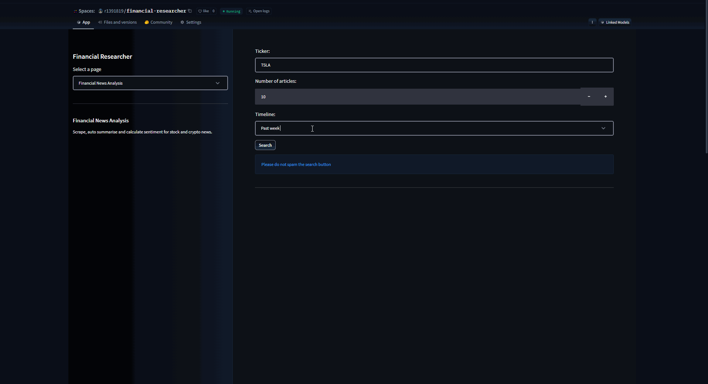

<div align="center">
  
  <h1>Financial Researcher</h1>

</div>

<div align="justify">

This project aims to provide a relatively simple solution to performing financial analysis by leveraging various tools and technologies. It combines data scraping, natural language processing, sentiment analysis, and stock trend forecasting to offer insights for stock and crypto investments.

## Roadmap

- [x] Scrape data from Yahoo Finance
- [x] Perform summarisation and sentiment analysis using fine-tuned Transformers models (BERT and Pegasus)
- [x] Design main dashboard
- [x] Implement stock trend forecasting functionality using Prophet

## Stack

- Requests
- BeautifulSoup
- Hugging Face
- Fine-tuned Transformers models
  - [Pegasus](https://huggingface.co/human-centered-summarization/financial-summarization-pegasus)
  - [BERT](https://huggingface.co/ahmedrachid/FinancialBERT-Sentiment-Analysis)
- Streamlit
- Prophet

## Highlights

<div align="center">
  
</div>

## Getting Started
### Installation

1. Clone the repo
   ```sh
   git clone https://github.com/1391819/financial-researcher
   ```
2. Install all the required libraries
   ```sh
   pip install -r requirements.txt
   ```
3. Run the Streamlit app
   ```sh
   streamlit run app.py
   ```

## Attributions

- <a href="https://www.flaticon.com/free-icons/stock-market" title="stock market icons">Stock market icons created by Umeicon - Flaticon</a>

## License

[MIT](https://github.com/1391819/financial-researcher/blob/main/License.txt) © [Roberto Nacu](https://github.com/1391819)

</div>

